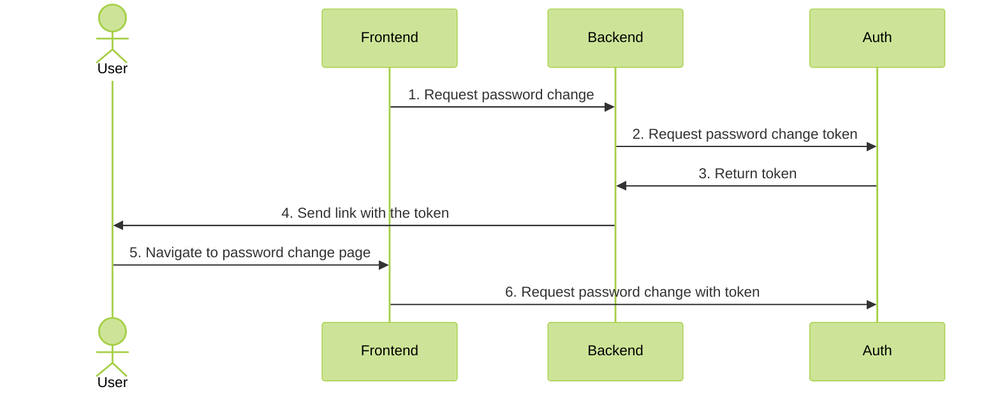

# Change password

### 1. Concept


Particular user flows may differ from application to application. 
Due to security reasons, it's recommended to send the token to user through third party communication channel, like email.
In this recipe, email flow will be assumed, but the token can be returned directly to the frontend.



### 2. Core setup

None! Changing password works out of the box

### 3. Backend setup

First, get the **api key** from Core logs during first boot. You can also read them from file called `secret`.

Add `AuthModule` and `AdminModule` to your application. Set the `apiKey` to the key fetched earlier.

```ts
@Module({
  imports: [
    AuthModule.forRoot({
      global: true,
      core: {
        host: 'AUTH HOST',
        apiKey: 'API KEY'
      }
    }),
    AdminModule
  ],
})
export class AppModule {}
```

Next, create an endpoint for resetting the password. Use `AuthUserRepository` for easy communication with the Core.

```ts
@Controller()
export class ExampleController {

  constructor(private readonly authUserRepository: AuthUserRepository) {
  }

  @Post()
  public async resetPassword(@User() user: UserDto, @Body() { oldPassword }: ChangePasswordRequest) {
      const { token } = await this.authUserRepository.generateChangePasswordToken(user.id, oldPassword);
      
      // Logic to send the token to the user
      await this.someEmailSender.sendEmail('changePasswordEmail', {token})
  }
}
```
