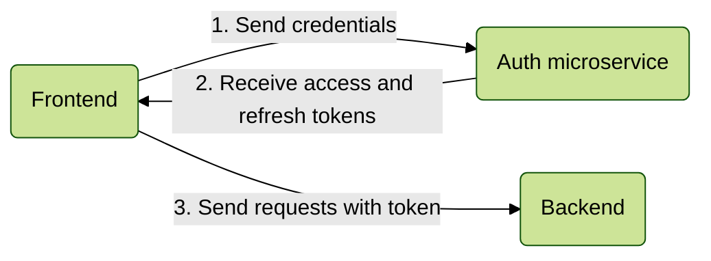

# Login flow

### 1. Concept



### 2. Core setup

None! Logging in works out of the box

### 3. Backend setup

First, add `AuthModule` to your application. Set `registerMiddleware` to `true`, it will allow for authentication of the user by the sent token.

```ts
@Module({
  imports: [
    AuthModule.forRoot({
      global: true,
      registerMiddleware: true,
      core: {
        host: 'AUTH HOST',
      }
    })
  ],
})
export class AppModule {}
```

Next, add the guard globally so unauthorized users do not have access

```ts
async function bootstrap() {
  const app = await NestFactory.create(AppModule);
  app.useGlobalGuards(
    await app.resolve(AuthGuard)
  );
  await app.listen(3333);
}
```
By default, every route requires the user to be authenticated.
If you want a route to be accessible without authentication, use `@Public()` decorator.

```ts
@Controller()
export class ExampleController {
  @Get()
  @Public()
  public async publicRoute() {
    Logger.verbose("Public route was accessed")
  }
}
```

or make the whole controller public

```ts
@Controller()
@Public()
export class PublicExampleController {
  @Get()
  public async route() {
    Logger.verbose("Route of a public controller was accessed")
  }
}
```
