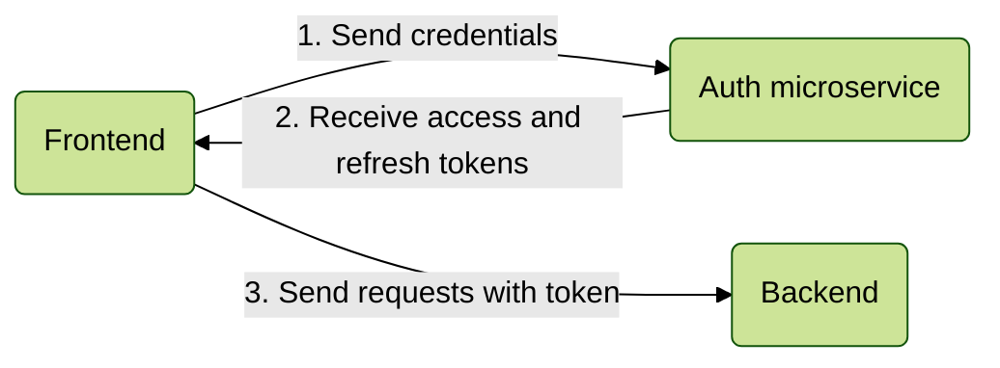

# Register flow

### 1. Concept

### 2. Core setup

None! Registering works out of the box

### 3. Backend setup

See [Login flow](./login-flow.md) for more information about how to authenticate the user.
