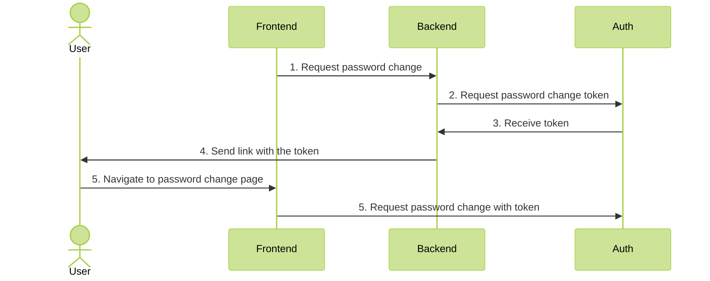

# Reset password

### 1. Concept



### 2. Core setup

None! Resetting password works out of the box

### 3. Backend setup

First, get the **api key** from Auth Core logs during first boot. You can also read them from file called `secret`.

Add `AuthModule` and `AdminModule` to your application. Set the `apiKey` to the key fetched earlier.

```ts
@Module({
  imports: [
    AuthModule.forRoot({
      global: true,
      core: {
        host: 'AUTH HOST',
        apiKey: 'API KEY'
      }
    }),
    AdminModule
  ],
})
export class AppModule {}
```

Next, create an endpoint for resetting the password. Use `AuthUserRepository` for easy communication with the Core.

```ts
@Controller()
export class ExampleController {

  constructor(private readonly authUserRepository: AuthUserRepository) {
  }

  @Post()
  public async resetPassword(@User() user: UserDto) {
      const { token } = await this.authUserRepository.generateChangePasswordToken(user.id);
      
      // Logic to send the token to the user
      await this.someEmailSender.sendEmail('resetPasswordEmail', {token})
  }
}
```
