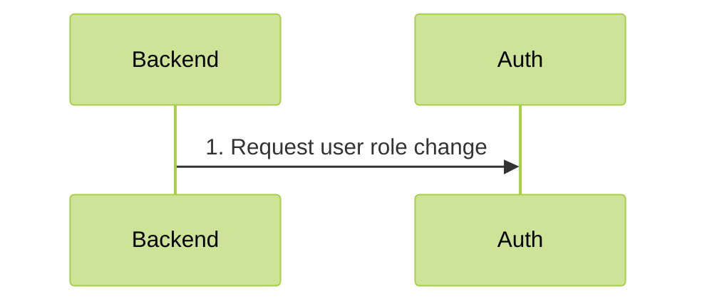

# Roles

### 1. Concept

Role checking does not require any communication with the Auth Core.

For role management:



### 2. Core setup

None! Roles work out of the box

### 3. Backend setup

First, get the **api key** from Auth Core logs during first boot. You can also read them from file called `secret`.

Add `AuthModule`, and `AdminModule` to your application. Set the `apiKey` to the key fetched earlier.

:warning: If your backend only checks roles, but does not change them, `AdminModules` and `apiKey` are not required :warning:

```ts

@Module({
  imports: [
    AuthModule.forRoot({
      global: true,
      core: {
        host: 'AUTH HOST',
        apiKey: 'API KEY'
      }
    }),
    AdminModule
  ],
})
export class AppModule {
}
```
Next, add the role guard globally so roles will be checked for endpoints

```ts
async function bootstrap() {
  const app = await NestFactory.create(AppModule);
  app.useGlobalGuards(
    await app.resolve(AuthGuard),
    await app.resolve(RoleGuard)
  );
  await app.listen(3333);
}
```

Finally, create a controller, that requires a role

```ts
@Controller()
export class ExampleAdminController {
  @Get()
  @Roles('admin')
  public async adminRoute() {
    Logger.verbose("Admin route was accessed")
  }
}
```


To change user's role, use the `AuthUserRepository` for easy communication with the Core.

```ts
@Injectable()
export class SomeService {
  constructor(private readonly authUserRepository: AuthUserRepository) {}
  
  public async promoteToAdmin(userId: string){
      await this.authUserRepository.addRole(userId, 'admin');
  }
  
  public async demoteFromAdmin(userId: string){
      await this.authUserRepository.removeRole(userId, 'admin');
  }
}
```
