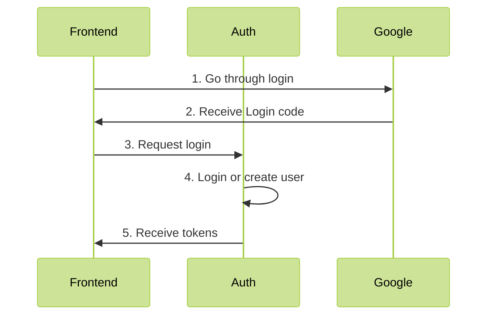

# Social login: Google

### 1. Concept

### 2. Core setup

Logging in with Google requires `@longucodes/auth-plugin-google` plugin to be loaded. 
For plugin configuration options, see [README](../../libs/auth-plugin-google/README.md)

### 3. Backend setup

Nothing! Everything is implemented in the Auth Core
