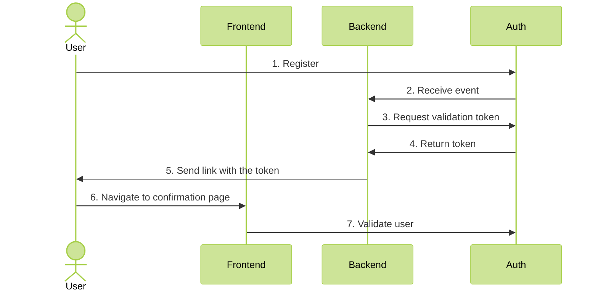

# User validation

### 1. Concept


Particular validation flows may differ from application to application.
In this recipe, email validation is assumed.



### 2. Core setup

By default, user validation is turned off. To enable it, pass `true` in the environment variable `USER__VALIDATION`

### 3. Backend setup

First, get the **api key** from Auth Core logs during first boot. You can also read them from file called `secret`.

Add `AuthModule`, `AuthEventsModule` and `AdminModule` to your application. Set the `apiKey` to the key fetched earlier.

```ts

@Module({
  imports: [
    AuthModule.forRoot({
      global: true,
      core: {
        host: 'AUTH HOST',
        apiKey: 'API KEY'
      }
    }),
    AuthEventsModule.forRoot({
      global: true
    }),
    AdminModule
  ],
})
export class AppModule {
}
```

Next, create an event listener for generating the token and sending the email. Use `AuthUserRepository` for easy communication with the Core.

```ts
@Injectable()
export class ExampleEventListener {

  constructor(private readonly authUserRepository: AuthUserRepository) {
  }

  @OnEvent(`auth.${RegisterEvent.Name}`)
  public async onRegister(event: RegisterEvent.Payload) {
    const { token } = await this.authUserRepository.generatevalidationToken(event.id);

    // Logic to send the token to the user
    await this.someEmailSender.sendEmail('confirmEmail', { token })
  }
}
```
